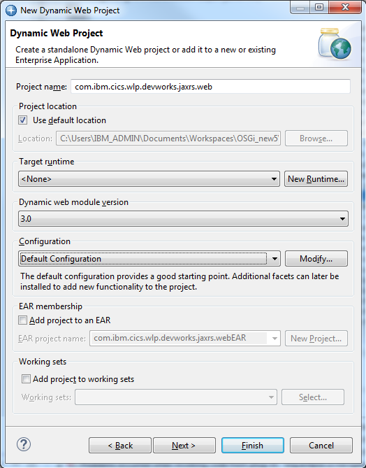
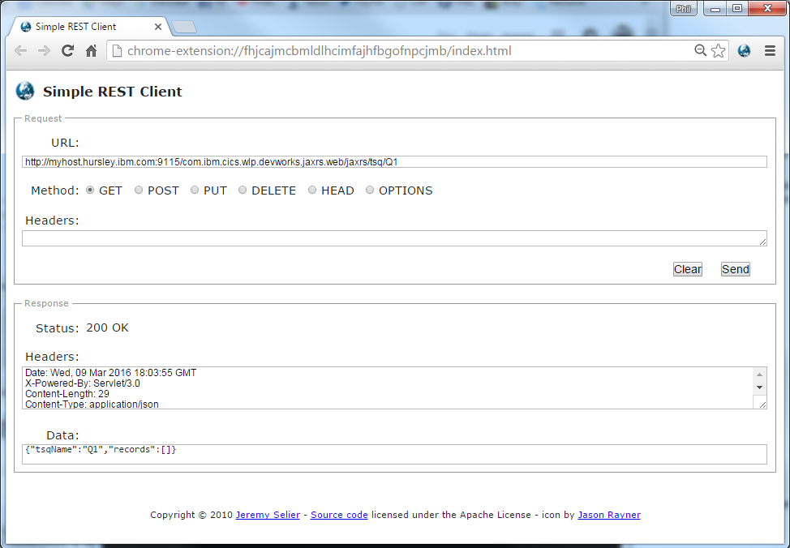
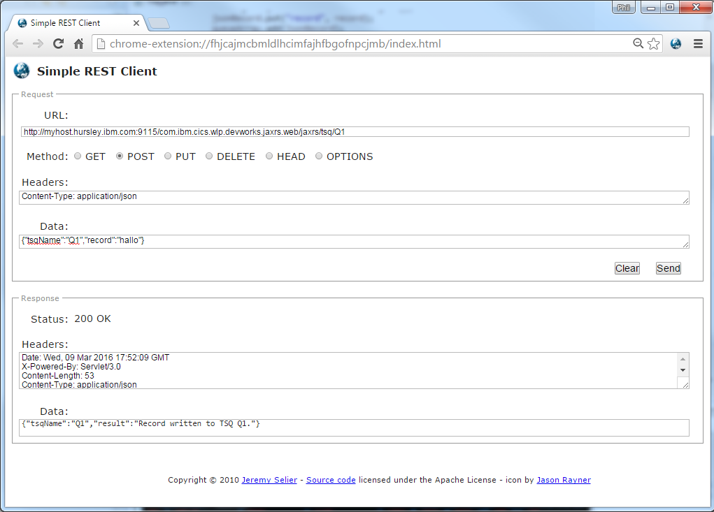

Developing RESTful web services in Liberty with JAX-RS
======================================================
Author: Phil Wakelin

This article explains how to build and deploy a RESTful service into a
CICS Liberty JVM server based on the WebSphere Liberty JAX-RS feature
and the IBMRestServlet. The article is based on an original blog by
Daniel Fitzgerald.

### Why REST?

The CICS Liberty server offers a lightweight Java container with all the
features of Java Servlets and Java Server Pages (JSP's) as well as local
access to your existing CICS applications and data. You can expose these
existing resources to the web using Java Servlets hosted in the CICS
Liberty server and expose them in a RESTful way. But before we begin
what exactly is REST?

The term 'REST' refers to REpresentational State Transfer, a design
pattern for interacting with resources stored in a server. Each resource
has an identity, a data type, and supports a set of actions. The RESTful
design pattern is usually used in combination with HTTP, the language of
the internet. In this context the resource's identity is its URI, the
data type is its Media Type, and the actions are made up of the standard
HTTP methods GET, PUT, POST and DELETE.

### REST vs SOAP

Now we understand what REST is, why would we want to use it? Why not use
Simple Object Access Protocol (SOAP)?

-   RESTful designs tend to be simpler, easier to understand and work
    much more closely to the way the web works
-   SOAP and Web Services Description Language (WSDL) are designed to be
    machine-readable, RESTful URIs should be human readable and describe
    the data being exposed. This makes testing and debugging simpler and
    easier.
-   RESTful designs put the onus on the client to remember state and by
    careful use of the 'Expires' HTTP header can improve caching while
    reducing server-side complexity.
-   You can use JSON in a REST implementation, a data interchange format
    that can be more efficient to parse than the equivalent XML, whereas
    SOAP requires XML.

### JAX-RS

A quick note on exactly what JAX-RS is. It stands for Java API for
RESTful web services and is used for designing web services according to
the REST design pattern. It uses annotations to convert between Java and
web data. There are many implementations of JAX-RS in use today
including WebSphere Liberty, Apache Wink or Jersey.

Prerequisites
-------------

Firstly there a few things you need before you can begin:

1.  A CICS TS V5.1 (or later) region. Note if you are using V5.1 you
    will need APAR PM80214 applied.
2.  A JVM server running the web container based on Liberty with the
    jaxrs-1.1 feature enabled. For more details on configuring a Liberty
    JVM server, see the [CICS documentation](https://www.ibm.com/support/knowledgecenter/SSGMCP_5.6.0/configuring/java/config_jvmserver_liberty.html)
3.  An Eclipse IDE 4.4 or later -- This can easily be downloaded from
    [Eclipse for Java EE Developers](http://www.eclipse.org/downloads/packages/%22)
4.  The CICS Explorer SDK installed into the Eclipse IDE, this should
    include the SDK for Servlet and JSP support. For further details
    refer to [Download Eclipse
    Tools](https://developer.ibm.com/mainframe/products/downloads/) page
5.  IBM WebSphere Application Server V8.5.5 Developer Tools (WDT) for
    Eclipse installed into the Eclipse IDE. Note if you are using CICS
    Explorer V5.3 or later these will be installed as part of the CICS
    SDK for Servlet and JSP support
6.  Download the working sample code if required here [GitHub
    download](#download)

Implementation
--------------

The CICS Liberty server creates a directory structure in zFS, including
a server.xml file if you have auto-configure on in your JVM profile. It
is in this file that you configure the features that you want to use.
This is one of the main design points of Liberty, that you enable only
the features you wish to use, resulting in the runtime footprint of the
server being a lot smaller than traditional application servers. You can
access the server.xml file on zFS using the z/OS perspective in CICS
Explorer.

Once you have the CICS Liberty server setup with the jaxrs-1.1 feature
let's begin writing our RESTful application. We are going to be using an
existing CICS sample project included with the CICS Explorer that
interacts with TSQs. What we will be doing is creating a RESTful
interface to this application and exposing the TSQ read, write, browse
and delete operations as a RESTful service.

JAX-RS uses annotations such as \@GET, \@Produces and \@Consumes to map
resource classes (POJOs -- Plain Old Java Objects) to web resources.
Those who know Java may have worked with annotations before and those
specific to JAX-RS should be familiar to web developers.

1. Next in Eclipse create a new Dynamic Web project **(New -\> Dynamic
Web Project**). We called our project
*com.ibm.cics.wlp.devworks.jaxrs.web*. Leave the target run-time as
\<None\> and deselect *Add project to an EAR*. You must also add web
support, so be careful to choose web module version 3.0 to ensure that
you use servlet-3.0 from the Java EE 6 specification.



On the next screen the source folders option does not need to be
modified, and finally select the box to to generate a web.xml deployment
descriptor as this makes servlet configuration easier.

2. Having created the project, the first job is to add the CICS and web
Java libraries to the project so that the servlet and JCICS APIs are
made available. To do this right-click on the project and select **Build
Path -\> Configure Build Path**. Click **Add Library** and select
**Liberty JVM server libraries**.

3. Next since we are going to extend the CICS Liberty TSQ sample, we
need to copy into our application the packages from the TSQ sample. Use
the following menu to create the TSQ sample: **Examples -\> CICS
Examples -\> Servlet and JSP -\> CICS Temporary Storage Queue**

This creates the 4 different projects the TSQ sample requires. Open the
com.ibm.cics.server.examples.wlp.tsq OSGi bundle project, and copy the 4
classes (BrowseTsqOSGi, DeleteTsqOSGi, TsqInfoOSGi, WriteTsqOSGi) in the
com.ibm.server.examples.wlp.tsq package into the src folder of the
dynamic web project so they will be available to the application.

4. Now create a new package com.ibm.cics.wlp.devworks.jaxrs.web and add
a new class in the project src folder and name it Tsq. Within this class
add the following import statements for the business logic classes we
copied into our project in step 3.

``` Java
import com.ibm.cics.server.examples.wlp.tsq.BrowseTsqOSGi;
import com.ibm.cics.server.examples.wlp.tsq.DeleteTsqOSGi;
import com.ibm.cics.server.examples.wlp.tsq.TsqInfoOSGi;
import com.ibm.cics.server.examples.wlp.tsq.WriteTsqOSGi;
```

5. Above the class declaration add the \@Path annotation to define the
URI path to this class.

```Java
@javax.ws.rs.Path("/tsq/{tsqName}")
public class Tsq {
....
}
```

If the URI path ends in `/tsq/{tsqName} ` the data contained in the
{tsqName} portion will be sent to our Tsq class. For example when a HTTP
request that looks like this is received:

`http://hostname:port/<webapp>/jaxrs/tsq/Q1`

**Q1** will be passed as a parameter to the method annotated with
the` @GET`.

Take a look at the code sample below to see our `browseTsq()` method
which is annotated with the `@GET `annotation. This return a
**JSONObject** which is an unordered Map of name/value pairs, which
makes returning JSON data to the client very simple.

```javax

    @javax.ws.rs.GET
    @Produces("application/json")
    public JSONObject browseTsq(@javax.ws.rs.PathParam("tsqName") String tsqName) throws Exception {
    {
        //create the object that will interact with the TSQ
        BrowseTsqOSGi browseTsq = new BrowseTsqOSGi();

        // create an ArrayList, insert the TSQ records but handle QIDERR
        ArrayList<String> records = new ArrayList<String>();        
        try {
            records = browseTsq.browseTSQ(tsqName);
        } catch (Exception e) {
            if (e instanceof com.ibm.cics.server.InvalidQueueIdException){              
        } else {
            throw e;
            }
        }

        //Put each record into a JSONObject and add it to a JSONArray
        JSONArray queueArray = new JSONArray();
        for(String record: records)
        {
            JSONObject jsonRecord = new JSONObject();
            jsonRecord.put("record", record);
            queueArray.add(jsonRecord);
        }

        //create an JSONObject to return
        JSONObject tsq = new JSONObject();

        //put the name of the TSQ
        tsq.put("tsqName", tsqName);

        //put the array of records
        tsq.put("records", queueArray);

        //return the object
        return tsq;
    }

```

Notice the use of the `@Produces` annotation that declares that this
method produces (returns) a content type of \'application/json\'.
Another important feature used is the `@PathParam` annotation. This is
used in the method signature and allows us to assign URI path parameter
to variables. In the example above we obtain the String, tsqName from
the URI which will then then use as the name of the TSQ for operations
in CICS.

In the example the annotations indicate the Java methods that correspond
to the HTTP methods, any parameters supplied in the URI have been
obtained and that data has been used to interact with a CICS resource.
You can write Java methods for all the HTTP methods, such as GET, PUT,
POST and DELETE that you wish to support in your resource class, and you
can find working examples for these in our supplied sample code.

Once you've written all your methods, the deployment descriptor must be
configured. If you correctly added Web 3.0 support and selected the
option to generate a deployment descriptor there will be a file called
web.xml. If you didn't add web support, it's not too late. Right click
on the project in the Package Explorer view in Eclipse and open
Properties. Choose Project Facet and check the Dynamic Web Module
option, choosing version 3.0, press OK. Right click on the project
again, go to Java EE Tools, select Generate Deployment Descriptor stub.
The deployment descriptor (web.xml) is located in the following folder:
WebContent/WEB-INF.

6. Open the web.xml file and add the following lines after the
`welcome-file-list` tag.

```xml
    <servlet>
        <description>IBM JAX-RS service</description>
        <display-name>IBM JAX-RS service</display-name>
        <servlet-name>IBMJAXRS</servlet-name>
        <servlet-class>com.ibm.websphere.jaxrs.server.IBMRestServlet</servlet-class>
        <init-param>
            <param-name>javax.ws.rs.Application</param-name>
            <param-value>com.ibm.cics.wlp.devworks.jaxrs.web.TsqConfig</param-value>
        </init-param>
    </servlet>
    <servlet-mapping>
        <servlet-name>IBMJAXRS</servlet-name>
        <url-pattern>/jaxrs/*</url-pattern>
    </servlet-mapping>
```

You can see that just one servlet is registered in this file, the
IBMRestServlet, which receives all incoming HTTP requests. This servlet
is supplied by Liberty and looks at the URI of the request and forwards
it to the appropriate servlet class based on the \@Path annotation.
Hence why only one \<servlet-class\> is defined. You must also define an
\<init-param\>. This is a servlet initialization parameter that is used
to point to a configuration subclass. This subclass returns the set of
Java classes that provides for the RESTful implementation.

7. We have not created this configuration class yet so create a new
class in the web project and call it TsqConfig. This configuration class
returns a list of the JAX-RS resource classes that make up the
application. In this example there is only one class which just returns
our Tsq class. See the example below:

```Java
public class TsqConfig extends javax.ws.rs.core.Application
{   
    //List the JAX-RS classes that contain annotations
    public Set<Class<?>> getClasses()
    {
        Set<Class<?>> classes = new HashSet<Class<?>>();
        classes.add(com.ibm.cics.wlp.devworks.jaxrs.web.Tsq.class);
        return classes;
    }
}
```

8. Create a new CICS Bundle Project and name it, we used the format
*com.ibm.cics.wlp.devworks.jaxrs.cicsbundle*.

i.  In the Bundle Overview select **New** to specify the CICS resources
    to be installed within this bundle. Choose **Dynamic Web Project
    Include** and in the next window select the web project containing
    the web application.
ii. In the *JVM Server* name field enter the name of the JVM server you
    will be using in your CICS region

Your CICS Bundle should now contain a file with a .warbundle file
extension and a folder called META-INF that contains a cics.xml file.
This can now be used to install the web application into CICS

9. Right click on the CICS Bundle project and select **Export project
to z/OS UNIX File System**. Click the option to Export to a specific
location in the file system, and then choose a location where to store
the bundle. If you already have CICS Bundles stored on zFS it's best to
put it in that location.

10\. Define and install a CICS BUNDLE resource that refers to the zFS
location from step 10. See the useful link section for further
information on how to define BUNDLE resources in CICS.

### The final result

And that's it you are ready to test out your new RESTful TSQ browsing
service. Let's take a look at sending some requests. First we will just
issue a HTTP GET to read a TSQ.

Using the Chrome Simple REST client enter a GET for the following URL:

`http://myhost.ibm.com:<port>/com.ibm.cics.wlp.devworks.jaxrs.web/jaxrs/tsq/Q1`

If the application is working this should return an HTTP 200 with a JSON
response containing a records object with an empty array, as follows:



Next we'll create a new TSQ by sending a POST request. To create a TSQ
we need to POST a HTTP request with a JSON content type, passing in the
tsqName and record values in a JSON payload. If using the Chrome Simple
REST client you will need to enter the following values

-   Headers: `Content-Type: application/json`
-   Data: `{"tsqName":"Q1","record":"hallo"}`

This should also return a HTTP 200. If you have imported the sample you
should now be able to also use the PUT and DELETE methods to browse the
TSQs on your CICS region using your Liberty server.



### Summary

You now have a working RESTful web service deployed in a CICS Liberty
JVM server. We have discussed how the different JAX-RS annotations aid
the conversion from Plain Old Java Objects (POJO's) to web resources. We
have shown how easy it is to access CICS resources and expose them via
the web in a way that is quick and easy to set up. This should just be
the beginning of your journey to discover how the Liberty technology
embedded in CICS can quickly and easily be used to create services that
can be consumed in a range of programming languages and be the basis of
a web site or mobile applications.

### Useful links

-   [Chrome Simple REST client](https://chrome.google.com/webstore/detail/simple-rest-client/fhjcajmcbmldlhcimfajhfbgofnpcjmb?hl=en)
-   Knowledge Center -- [Configuring a Liberty JVM
    server](https://www.ibm.com/support/knowledgecenter/SSGMCP_5.6.0/configuring/java/config_jvmserver_liberty.html)
-   Knowledge Center -- [CICS Liberty features](https://www.ibm.com/support/knowledgecenter/SSGMCP_5.6.0/applications/developing/java/liberty_features.html)


### Code download

The Java sample code from this article is available for download and can
be imported into an Eclipse IDE using using the following procedure:

1.  Download the source from the
    [cics-java-liberty-jaxrs](https://github.com/cicsdev/cics-java-liberty-jaxrs)
    GitHub repository
2.  Unzip the archive and copy the com/ibm/cics/wlp/devworks/jaxrs/web
    folder into the Java Resources/src folder of your web project

### Converting to a WAB

If anyone is wondering how to convert this to an Web enabled OSGi bundle (WAB), then this can be done using the WDT wizard: Source -\> Convert to OSGi bundle project, and then adding the right package imports, and then adding this WAB to an OSGi application project (EBA). Here is a working OSGI manifest for the converted WAB:
```
Manifest-Version: 1.0
Bundle-ManifestVersion: 2
Bundle-Name: com.ibm.cics.wlp.devworks.jaxrs.osgi.web
Bundle-SymbolicName: com.ibm.cics.wlp.devworks.jaxrs.osgi.web
Bundle-Version: 1.0.0
Bundle-ClassPath: WEB-INF/classes
Web-ContextPath: /com.ibm.cics.wlp.devworks.jaxrs.web
Bundle-RequiredExecutionEnvironment: JavaSE-1.7
Import-Package: com.ibm.cics.server;version=”[1.400.0,2.0.0)”,
com.ibm.json.java;version=”[1.0.0,2.0.0)”,
com.ibm.websphere.jaxrs.server;version=”[1.1.0,2.0.0)”,
javax.ws.rs;version=”[1.1.0,2.0.0)”,
javax.ws.rs.core;version=”[1.1.0,2.0.0)”
```
#### Change history

- 21/Mar/16 -- article updated to refer to repository download
- 06/Apr/16 -- code update to handle empty queue
